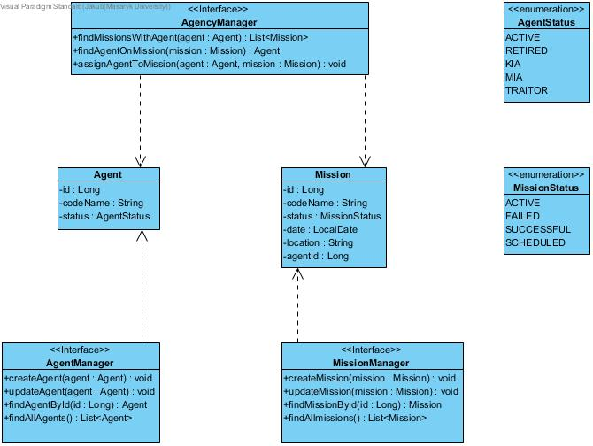
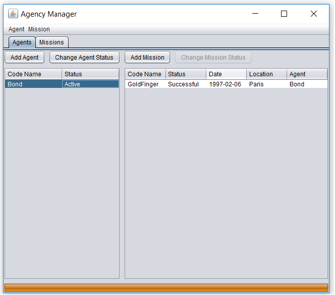
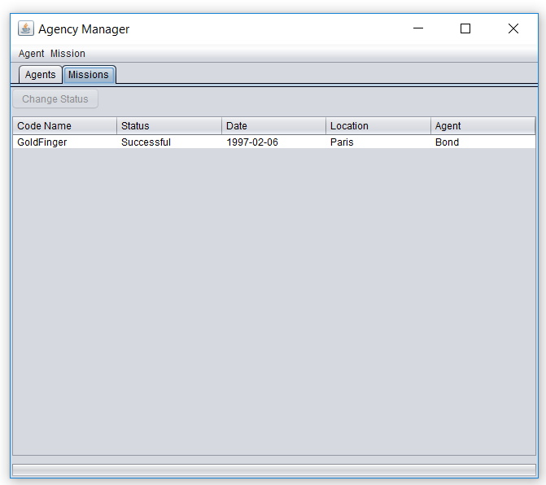

# PV168 - Agency Manager

Manager for administration of agents and missions they take part in.
Application use two types of entities. Set of agents and set of missions.

Every mission has exactly 1 agent at any time. (No missions without assigned agent.)

Use-case diagram:

Class diagram:

GUI example:

